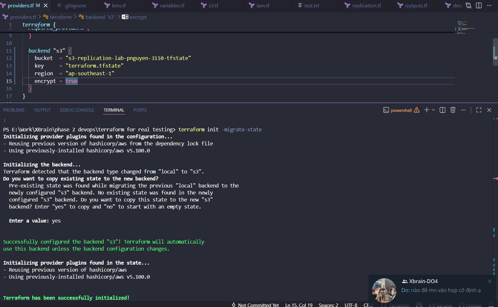
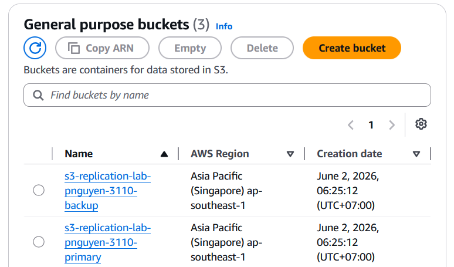
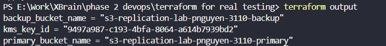

# 1. The Terraform block must include the s3 state/required_version/required_provider as its backend

## Where in the terraform scripts:
* In `providers.md`:
```
  backend "s3" {

    bucket  = "s3-replication-lab-pnguyen-3110-tfstate"

    key     = "terraform.tfstate"

    region  = "ap-southeast-1"

    encrypt = true

  }
```
* The backend is stored on AWS S3 (specifically `s3-replication-lab-pnguyen-3110-tfstate`)
## Evidence:
* Evidence that it works (successful migration from old local code - can be found on version history on Github):

---
# 2. Must setup at least 2 S3 buckets.

## Where in the terraform script:
* In the `s3.tf`:
```
#Primary bucket

resource "aws_s3_bucket" "primary" {

  bucket = "${var.project_name}-primary"

  

  tags = {

    Name        = "Primary Data Bucket"

    Environment = var.environment

  }

}

  

# Enable Versioning

resource "aws_s3_bucket_versioning" "primary_versioning" {

  bucket = aws_s3_bucket.primary.id

  versioning_configuration {

    status = "Enabled"

  }

}

  

# Encrypt the Primary Bucket by KMS Key

resource "aws_s3_bucket_server_side_encryption_configuration" "primary_crypto" {

  bucket = aws_s3_bucket.primary.id

  

  rule {

    apply_server_side_encryption_by_default {

      #IMPLICIT DEPENDENCY:

      kms_master_key_id = aws_kms_key.s3_key.arn

      sse_algorithm     = "aws:kms"

    }

  }

}

  

# Backup bucket

resource "aws_s3_bucket" "backup" {

  bucket = "${var.project_name}-backup"

  

  tags = {

    Name        = "Backup Replica Bucket"

    Environment = var.environment

  }

}

  

# Enable Versioning for Backup

resource "aws_s3_bucket_versioning" "backup_versioning" {

  bucket = aws_s3_bucket.backup.id

  versioning_configuration {

    status = "Enabled"

  }

}

  

# Encrypt Backup Bucket also by that KMS Key

resource "aws_s3_bucket_server_side_encryption_configuration" "backup_crypto" {

  bucket = aws_s3_bucket.backup.id

  

  rule {

    apply_server_side_encryption_by_default {

      kms_master_key_id = aws_kms_key.s3_key.arn

      sse_algorithm     = "aws:kms"

    }

  }

}
```

## Evidence:
* Evidence that it worked:

---
# 3. Must use variables
## Where in the terraform script:
* The `variables.tf`:
```
variable "aws_region" {

  description = "The AWS Region to deploy resources"

  type        = string

  default     = "ap-southeast-1"

}

  

variable "environment" {

  description = "The environment variable"

  type        = string

}

  

variable "project_name" {

  description = "The project name used as prefix for the resources"

  type        = string

  default     = "s3-replication-lab-pnguyen-3110"

}
```
---
# 4. Must use implicit/depends on
## Evidence on implicit dependency:
* In the `s3.tf` file, specifically in the `aws_s3_bucket_server_side_encryption_configuration` block of code:
```

  rule {

    apply_server_side_encryption_by_default {

      #IMPLICIT DEPENDENCY:

      kms_master_key_id = aws_kms_key.s3_key.arn

      sse_algorithm     = "aws:kms"

    }

  }

```
 and
```

  

  rule {

    apply_server_side_encryption_by_default {

      kms_master_key_id = aws_kms_key.s3_key.arn

      sse_algorithm     = "aws:kms"

    }

  }

```

## Evidence on Explicit Dependency
* In the `replication.tf`, specifically in the `aws_s3_bucket_replication_configuration` block of code, there is this line:
```
depends_on = [aws_iam_role_policy.replication]
```
---
# 5. Must have 1 evidence about import block/state mv/state rm

## State mv evidence:


I quickly changed it back to prevent having to change everything in the code.

---
# 6. Must have 1 evidence about secrets
## Setup:
* Firstly I deliberately added a few lines of code as so:
```
variable "fake_secret_token" {
  description = "A fake secret for evidence"
  type        = string
  sensitive   = true
  default     = "SuperSecretPassword123!"
}

output "secret_token_output" {
  value     = var.fake_secret_token
  sensitive = true
}
```
in the `variables.tf`. And then, in the VS Code terminal:
```bash
terraform apply -var-file="dev.tfvars"
```

## Evidence:
* The setup leads to this output change:

---
# 7. The outputs/locals must be made clear
* Notes: I see the slash there and assume it is that either of which must be fulfilled only. Similarly, I only provide one evidence on the Criteria no. 5. If you, my **dearest** mentor (seriously, I like your working style and want to learn from it), means that BOTH must be fulfilled, please let me know so that I can edit the code to fulfill this criteria as well as the Criteria no. 5.
## Evidence on the outputs made clear


